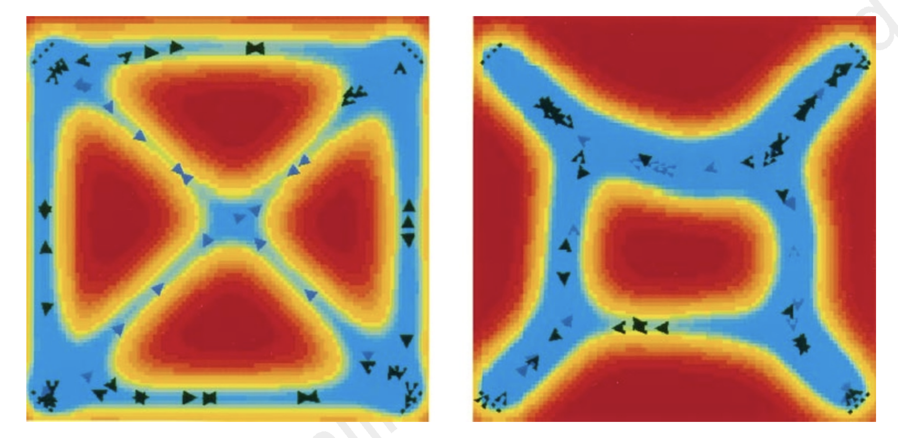
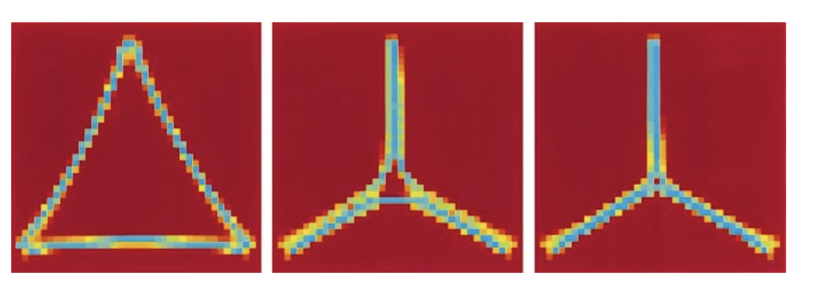

# The Active Walker Model
Reference: [_Modelling the Evolution of Human Trail Systems (Helbing, D., Keltsch, J., & Molnár, P. 1997)_](https://arxiv.org/abs/cond-mat/9805158)


Helbing, Keltsch, and Molnar introduce a model to describe pedestrian motion to explore the evolution of trails in urban green spaces such as parks. Honestly, I found their model difficult to follow given the dump of notation and confusing prose, so I've redescribed it below:

Let $G(\vec r, t):=$ the ground condition at position $\vec r$ and time $t$. This reflects the comfort of walking, where pedestrians (or 'active walkers') prefer higher values of $G$. Trails are charecterized by these high values of $G$.

Pedestrians, $\alpha$, at their position $\vec r = \vec r _\alpha (t)$ leave 'footprints.' These footprints have an assumed intensity. Let $I(\vec r):=$ the base intensity of how much a single footstep "wears the ground at position r" (independant of trail history). The assumed intensity of foot traffic is $I(\vec r)*[1- G(\vec r , t)/G_{max}(\vec r, t)]$. This causes a saturation effect by new footprints, where the closer you get to the max, the smaller each additional contribution becomes. 

The ground can also regenerate, restoring the ground to its intitial conditions, $G_0(\vec r)$. The restoration is charecterized by a 'weathering rate,' $\frac{1}{T(\vec r)}$ where $T(\vec r)$ describes the durability of the trail (this rate describes the weathering of the trail, not the ground. I know, bad terminology).


With this, we can describe the change in our ground condition with respect to time to be: 
```math
\begin{aligned}
\frac{dG(\vec r, t)}{dt} = \;
& \underbrace{\frac{1}{T(\vec r)}\left[G_0(\vec r) - G(\vec r, t)\right]}_{\text{regeneration toward } G_0} \\
& + \underbrace{I(\vec r)\left[1 - \frac{G(\vec r, t)}{G_{max}(\vec r, t)}\right]}_{\text{saturating wear per footstep}} \cdot \underbrace{\sum_{\alpha} \delta(\vec r - \vec r_\alpha(t))}_{\text{only where a walker stands}}
\end{aligned}
```

Next, we need to model a pedestrian's affinity for the ground beneath them. Let $V_{tr}(\vec r_\alpha, t):=$ the trail potential: how attractive the surrounding ground looks to walker $\alpha$, standing at $\vec r_\alpha$, at time $t$.


Attractiveness isn't just G at a point. It's everything the walker can see, weighted by how well they can see it. Nearby trail segments count more than distant ones, and how fast that fallout happens depends on the walker's visibility range, $\sigma(\vec r_\alpha)$.

$$
V_{tr}(\vec r_\alpha, t) = \int d^2r \; \underbrace{e^{-|\vec r - \vec r_\alpha|/\sigma(\vec r_\alpha)}}_{\text{decreases with distance, scaled by visibility}} \; \underbrace{G(\vec r, t)}_{\text{ground condition at } \vec r}
$$




Now we can discuss the walking direction $\vec e_\alpha$ of a pedestrian. There are two seperate attractors:
- **The Destination**. If a walker has a goal $d_\alpha$ and the ground is homogenous ($G(\vec r, t)$ is a constant), just go straight to it. $\frac{(\vec d_\alpha - \vec r_\alpha)}{|\vec d_\alpha - \vec r_\alpha|}$. 
- **Better Trails**. We also want to move in the direction with the greatest increase of ground attraction, given by the normalized gradient $\nabla_{r\alpha} V_{tr}(\vec r, t)$. 

We can combine these two attractors to get the walking direction $\vec e_\alpha$: add both raw pulls together, then normalize once, at the end:

$$
\vec e_\alpha(\vec r_\alpha, t) = \frac{\underbrace{(\vec d_\alpha - \vec r_\alpha)}_{\text{destination pull}} + \underbrace{\nabla_{r_\alpha} V_{tr}(\vec r_\alpha, t)}_{\text{trail pull}}}{\left|(\vec d_\alpha - \vec r_\alpha) + \nabla_{r_\alpha} V_{tr}(\vec r_\alpha, t)\right|}
$$

Because the sum is normalized only once, at the end, the *raw* length of the destination pull matters. Far from the destination, that term dominates. Close to it, the term shrinks, and nearby trails can pull the walker off a straight line.

Now that we have a direction, we have the following equation of motion:


$$
\frac{d\vec r_\alpha}{dt} = v_\alpha^0 \, \vec e_\alpha(\vec r_\alpha, t)
$$

$v_\alpha^0$ is just a scalar: the walker's preferred speed (the original authors mistakenly use velocity).


### Recap Of The Full Model 
Substituting $\vec e_\alpha$ into the equation of motion, three coupled equations:

```math
\begin{aligned}
\frac{dG(\vec r, t)}{dt} &= \frac{1}{T(\vec r)}\left[G_0(\vec r) - G(\vec r, t)\right] + I(\vec r)\left[1 - \frac{G(\vec r, t)}{G_{max}(\vec r)}\right] \sum_{\alpha} \delta(\vec r - \vec r_\alpha(t)) \\
V_{tr}(\vec r_\alpha, t) &= \int d^2r \; e^{-|\vec r - \vec r_\alpha|/\sigma(\vec r_\alpha)} \, G(\vec r, t) \\
\frac{d\vec r_\alpha}{dt} &= v_\alpha^0 \, \frac{(\vec d_\alpha - \vec r_\alpha) + \nabla_{r_\alpha} V_{tr}(\vec r_\alpha, t)}{\left|(\vec d_\alpha - \vec r_\alpha) + \nabla_{r_\alpha} V_{tr}(\vec r_\alpha, t)\right|}
\end{aligned}
```

Ground wears and regenerates ($G$), attractiveness aggregates that wear over a walker's field of view ($V_{tr}$), and the walker moves at their preferred speed toward a blend of destination and attractiveness ($d\vec r_\alpha/dt$) which wears the ground again, closing the loop.


### Rescaling

The model has only two natural scales, $\sigma$ (length) and $T$ (time), so measure everything in those units: $\tilde{\vec r} = \vec r/\sigma$ and $\tilde t = t/T$. $G$ is already dimensionless.

Everything else cancels. $V_{tr}$ and the direction $\vec e_\alpha$ come out parameter-free, and the only constants left are

$$
\kappa = \frac{IT}{\sigma^2}, \qquad \lambda = \frac{V^0 T}{\sigma}
$$

where $V^0$ is the average preferred speed. This is the version to actually implement:

```math
\begin{aligned}
\frac{d\tilde G}{d\tilde t} &= \left[\tilde G_0 - \tilde G\right] + \kappa\left[1 - \frac{\tilde G}{\tilde G_{max}}\right] \sum_{\alpha} \delta^2(\tilde{\vec r} - \tilde{\vec r}_\alpha) \\
\tilde V_{tr}(\tilde{\vec r}_\alpha, \tilde t) &= \int d^2\tilde r \; e^{-\|\tilde{\vec r} - \tilde{\vec r}_\alpha\|} \, \tilde G(\tilde{\vec r}, \tilde t) \\
\frac{d\tilde{\vec r}_\alpha}{d\tilde t} &= \lambda_\alpha \, \frac{(\tilde{\vec d}_\alpha - \tilde{\vec r}_\alpha) + \tilde\nabla \tilde V_{tr}}{\left\|(\tilde{\vec d}_\alpha - \tilde{\vec r}_\alpha) + \tilde\nabla \tilde V_{tr}\right\|}
\end{aligned}
```


Small $\kappa$ promotes destination-following and large $\kappa$ promotes trail-following behavior (see figure below).



$\lambda$ is the walker's speed in rescaled units:

$$
\lambda = \frac{T}{\sigma / V^0} = \frac{\text{trail lifetime}}{\text{time to cross your own sight radius}}
$$

So $\lambda$ counts how many sight-crossings fit inside one trail lifetime. 
