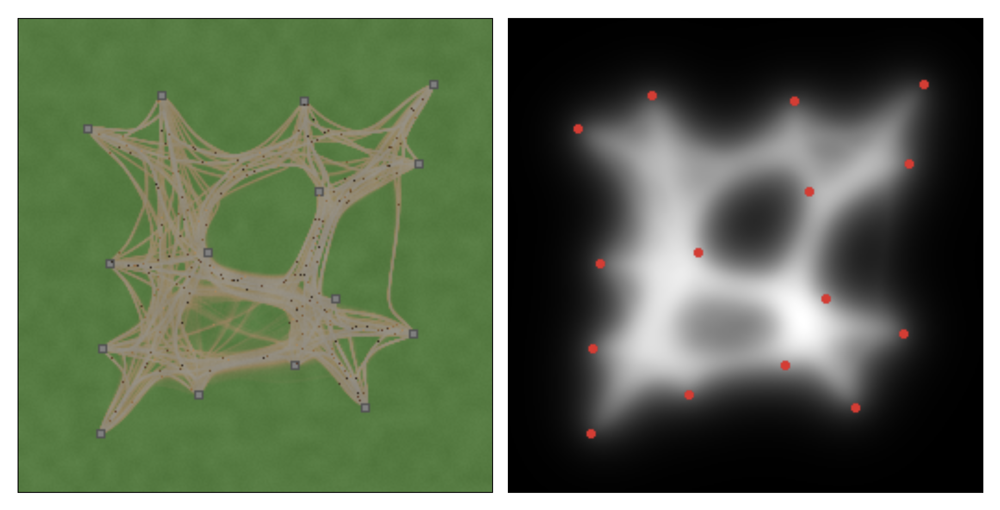

# Trail Formation Visualizations
Based on [_Modelling the Evolution of Human Trail Systems (Helbing, D., Keltsch, J., & Molnár, P. 1997)_](https://arxiv.org/abs/cond-mat/9805158)

Left: The ground conditions, $G$, worn from grass into trails, with walkers as dark specks. Right: The trail potential, $V$, that walkers steer by.

## Overview

An visualization of the active walker model. Helbing, Keltsch, and Molnar we inspired from models of structure formation in physical, chemical, and biological systems, and applied it to pedestrials as a tool for urban planning. 

Pedestrians wear down the ground wherever they walk. The worn ground is more comfortable than fresh grass, and so walkers drift toward paths other people have already made. Trails develop, combine, and erode over time. This model assumes walkers head for fixed destinations, can only see a limited distance around them, and ignore each other. 

*I've been playing a lot of city simulation games, so I was inspired to make my own living, self-organizing little world.*

## From the paper

The behaviour the model is meant to reproduce, from Helbing, Keltsch and Molnar. Three destinations, increasing trail attraction left to right. You can see it transition from separate direct paths to a single merged junction.

The trail potential for two systems, blue where walking is comfortable, with pedestrians as arrowheads.

## Documentation

- [MODEL.md](MODEL.md) — About the model and it's derivation
- [IMPLEMENTATION.md](IMPLEMENTATION.md) — About how I chose to implement the model (not up to date)
---
Why TypeScript? I didn't know TypeScript, so this was a good excuse to learn.
